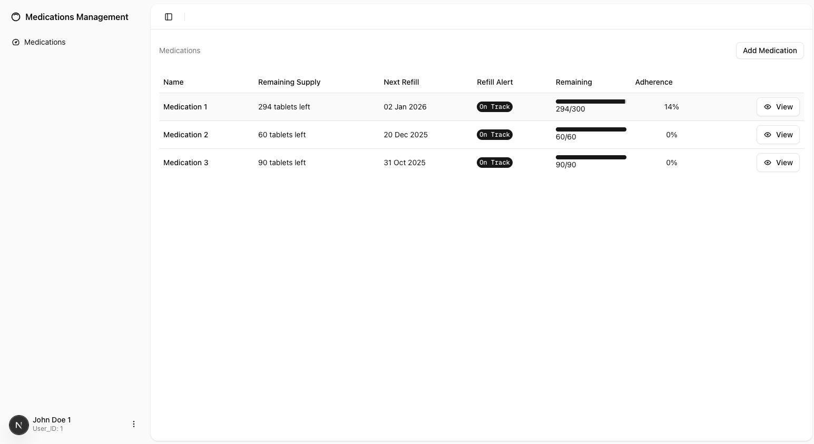
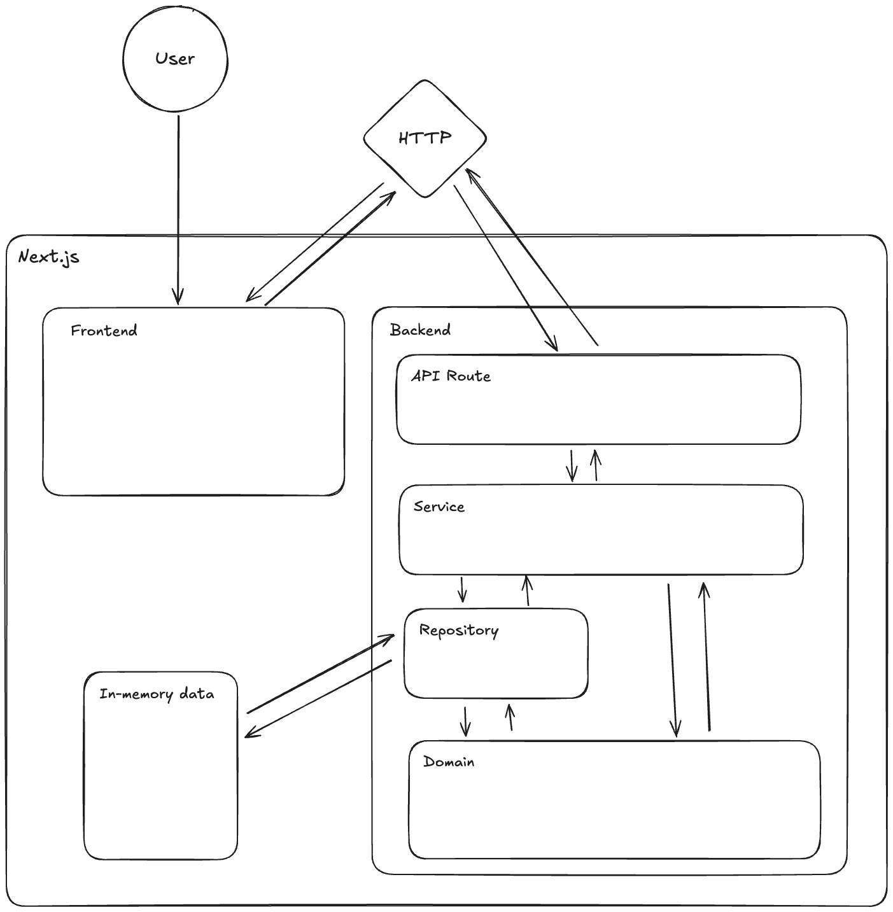
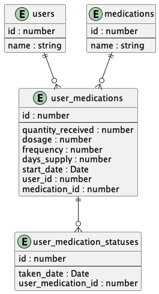

# Medication Management Application

## Live Demo
Try the deployed app on Vercel:  
👉 [https://medication-management-app-9z5u.vercel.app/](https://medication-management-app-9z5u.vercel.app/)

## Overview

A web application designed to help users manage their medications, track schedules, and monitor refills with ease.


---

## Getting Started Locally

### Installation

```bash
pnpm install
```

### Run for Development

```bash
pnpm dev
```

---

## Application Architecture


---

## Pages

| Page              | Path                            | Description                |
|-------------------|---------------------------------|----------------------------|
| Medication List   | `/`                             | View all medications       |

---

## Database Schema



---

## API Documentation

### GET `/users/:userId`

**Request:**  
_No body required_

**Response:**
```json
{
    "userId": number,
    "userName": string
}
```

---

### GET `/users/:userId/user-medications`

**Request:**  
_No body required_

**Response:**
```json
{
    "medicationId": string,
    "name": string,
    "remaining": number,
    "quantityReceived": number,
    "nextRefill": string,
    "refillStatus": number,
    "adherence": number
}
```

---

### POST `/users/:userId/user-medications`

**Request:**
```json
{
    "name": string,
    "dosage": number,
    "frequency": number,
    "quantityReceived": number,
    "daysSupply": number,
    "startDate": string
}
```

**Response:**
```json
{
    "id": number,
    "name": string,
    "dosage": number,
    "frequency": number,
    "quantityReceived": number,
    "daysSupply": number,
    "startDate": string
}
```

---

### PUT `/users/:userId/user-medications/:userMedicationId`

**Request:**
```json
{
    "name": string,
    "dosage": number,
    "frequency": number,
    "quantityReceived": number,
    "daysSupply": number,
    "startDate": string
}
```

**Response:**
```json
{
    "id": number,
    "name": string,
    "dosage": number,
    "frequency": number,
    "quantityReceived": number,
    "daysSupply": number,
    "startDate": string
}
```

---

### DELETE `/users/:userId/user-medications/:userMedicationId`

**Request:**  
_No body required_

**Response:**  
HTTP 204 No Content

---

### POST `/user-medications/:userMedicationId/taken`

**Request:**
```json
{
    "takenDate": string
}
```

**Response:**
```json
{
    "id": number,
    "takenDate": string
}
```

---

### DELETE `/user-medications/:userMedicationId/taken/:takenId`

**Request:**  
_No body required_

**Response:**  
HTTP 204 No Content

